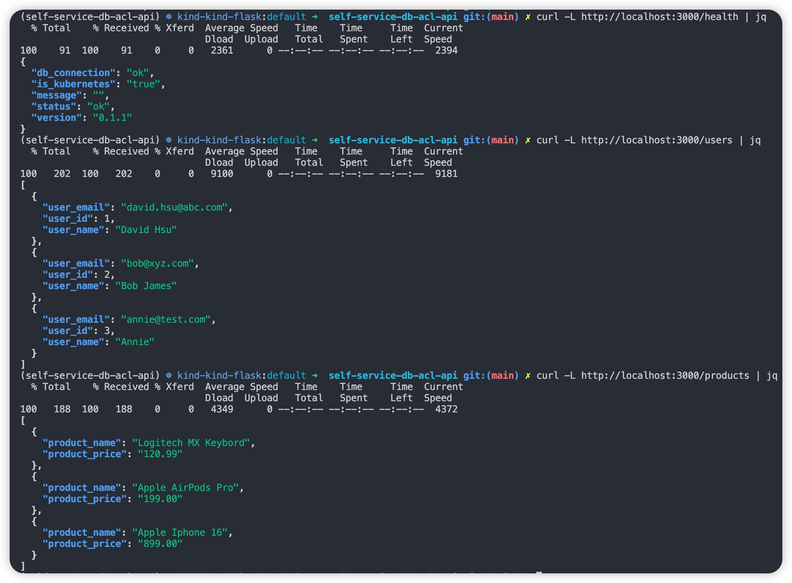

# self-service-db-anti-corruption
[](https://github.com/davidh83110/self-service-db-acl-api/actions/workflows/ci-build.yaml)
[](https://github.com/davidh83110/self-service-db-acl-api/actions/workflows/cd.yaml)
[](https://github.com/PyCQA/bandit)

### This is a Flak RESTful API with Postgres database running locally.
- [http://localhost:3000](http://localhost:3000)
- [http://localhost:3000/health](http://localhost:3000/health)



### We also launch a registry in the local Kubernetes cluster
🐳 Docker Registry 
```bash
curl -X GET http://127.0.0.1:30500/v2/_catalog_
curl -X GET http://127.0.0.1:30500/v2/postgres/tags/list  
```

### CI/CD (Github Actions)
We host a self-hosted Github Runner for CI/CD. When the changes committed, the workflows [ci-build.yaml](.github/workflows/ci-build.yaml) and [cd.yaml](.github/workflows/cd.yaml) will be triggered to build and push the images to local registry, then update the deployments if needed.


## How to Run
This Page will only focus on Flask application, 
if you need any information about `Helm` or run in `Kubernetes`, 
please visit [deploy/README.md](deploy%2FREADME.md).

### Quick Run
#### Docker Compose for launching without Kubernetes
```commandline
docker-compose up --build -d
```

#### Kind and Helm Chart
```commandline
cd ./deploy
sh ./startup.sh
```
- More information, please visit [deploy/README.md](deploy%2FREADME.md).

### Prerequisites
- Python >= 3.10
- Pipenv
- Docker 
- Redis Server

### Setup Environment
- Install Pipenv 
  ```commandline
  python -m pip install --upgrade pip
  pip install pipenv --no-cache-dir
  ```
- Install Dependencies
  ```commandline
  pipenv install --system --deploy --ignore-pipfile
  ```

  
### Start Flask Application
#### In Gunicorn without Docker
```commandline
gunicorn --bind 0.0.0.0:3000 \
            --access-logfile flask-app-gunicorn.log \
            --error-logfile flask-app-gunicron-error.log \
            --log-level debug \
            wsgi:app
```

#### In Gunicorn with Docker
- Build Docker Image
  ```commandline
   export APP_VERSION=0.0.1
   docker build --build-arg APP_VERSION=$APP_VERSION --no-cache -t flask-app .
  ```
- Run Docker Container
  ```commandline
  docker run -p 3000:3000 -it flask-app
  ```


### Check Result
After the applciation is started, you can always vivist the pages on browser --
[http://localhost:3000](http://localhost:3000) .


## Development
### Run under Pipenv Shell  
```bash
pipenv install --deploy
pipenv shell
python3 main.py
```
or 
```bash
pipenv install --deploy
pipenv run python3 main.py
```

### Install PYPI packages with Pipenv
```bash
pipenv install flask ...
pipenv update
```

### Run Unittest
```commandline
pipenv shell
pytest
```


## CI/CD 
I use `Github Actions` to implement a simple CI/CD pipeline, 
which includes `unittest`, `SAST evulation`, `docker build and push`, and `helm upgrade`.
- Please visit [ci-build.yaml](.github%2Fworkflows%2Fci-build.yaml) and [cd.yaml](.github/workflows/cd.yaml).
- SAST tool - [bandit](https://github.com/PyCQA/bandit)
- We could possibly optimize the pipeline to be faster and comment some messages on the Pull Request, but I just ignore those things since it is a demo only.

### The CI pipeline
Build and Push Docker Images of Flask and Postgres to local registry

### The CD pipeline
- Update ConfigMap if needed
- Upgrade Helm charts if needed
> We should improve the authentication. Now I'm just using a Service Account for this Runner.


## Versioning


I use a [VERSION](VERSION) file to control the Application version, which will be the `APP_VERSION` when we build the Docker Image.
But in real environment, I think we can do it with `tags triggering`, `auto increament`, or integrate with `Jira`/`Github Project`. 

For Postgres versioning, the image tag will always be the `Git Commit ID`.

