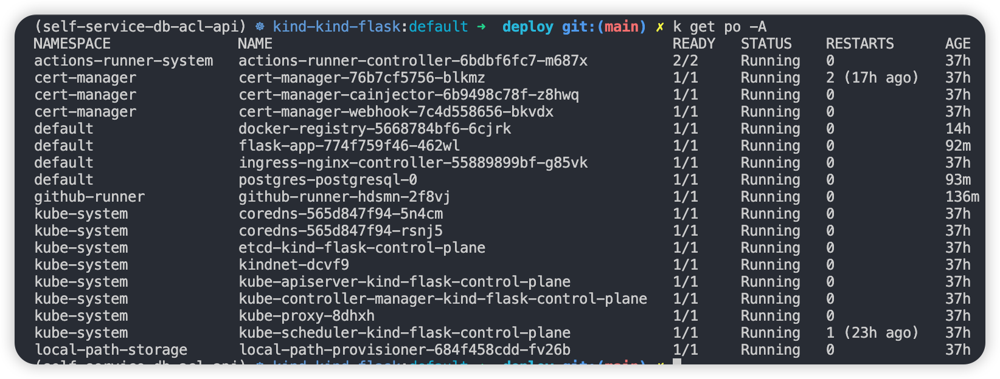

# Kubernetes Deploy
We will need to use `kind` and `helm` to launch the application locally.
- [Kind - Run Kubernetes Locally](https://kind.sigs.k8s.io/)

## Quick Start
This script [start.sh](./start.sh) will help you to launch the environment with the following components --
- [KinD](./infra/kind-conf.yaml)
- [Registry](./registry/registry.yaml)
- Ingress-Nginx
- Flask
- Postgres
- Cert-Manager
- Actions Runner Controller (ARC) and Github Runners
```commandline
sh ./start.sh
```


## Prerequisites
### Install Kind (MacOS)
```commandline
brew install kind
```

### Create a kind Cluster
```commandline
kind create cluster --config ./kind-conf.yaml -n kind-flask
```

- Allow `3000` port on the [kind-conf.yaml](kind-conf.yaml) for allowing port be accessed from local. 

For other Linux distribution, please visit the [Kind website - Installation](https://kind.sigs.k8s.io/docs/user/quick-start/#installation) for installation guide.

### Launch Ingress-Nginx
```commandline
helm install ingress-nginx ingress-nginx/ingress-nginx -f ./ingress-nginx-values.yaml
```
> We use `hostPort` here for Ingress because we run application locally, 
> if we go to cloud environments, 
> we should use LoadBalancer type Service or Load balancers from Cloud Providers and its controller, 
> e.g. AWS Application Load Balancer and Load Balancer Controller. 

### Launch Registry
```bash
kubectl apply -f ./registry/registry.yaml
curl -L "http://localhost:30500/v2/_catalog"
```
Launch a Registry inside of the Kubernetes cluster and expose a port. 
The registry will be in HTTP so that we don't need to deal with the self-signed certificate issue, which I believe we will have a verified certificate in real world.
> TODO: Support HTTPS for Registry

### Inject Secrets/ConfigMaps to Cluster
```commandline
kubectl create configmap mydb-init --from-file=../databases/init.sql

kubectl create configmap flask-config --from-file=../config.yaml
kubectl apply -f ./flask-secrets.yaml
```
#### Postgres SQL
We put the [init.sql](../databases/init.sql) in ConfigMap for mounting into the Postgres container for the first time running the database. Once the Postgres is running, the data will be persist in PVC, so the init.sql won't be execute after Pod restarts.

#### Flask ConfigMap
We create ConfigMap from the [config.yaml](../config.yaml) in repo for first time running this application. 

#### Flask Secrets
The secrets should be store in a secret store like AWS SecretsManager or Hashicorp Vault, then we retrieving them while container runtime. Even, we could integrate the SDK with our application so that the secrets won't be in Kubernetes Secrets, way more safer since Kubernetes Secrets is only Base64 encoding by default.


## Deploy Postgres and Flask
### Launch Postgres
```commandline
helm upgrade -i postgres bitnami/postgresql -f postgres-values.yaml
```
> We should use a custom Helm Chart of Postgres, which charts better managed on our own.
> But now I am using a public Chart for quick launching a Postgres as demo needed.

### Launch Flask Application
```commandline
helm upgrade -i flask-app ./charts -f ./flask-app-values.yaml
```

### Check Result
```
kubectl get pod -A
curl -L http://localhost:3000/
```



## Cleanup
```commandline
kind delete cluster -n kind-flask
```


